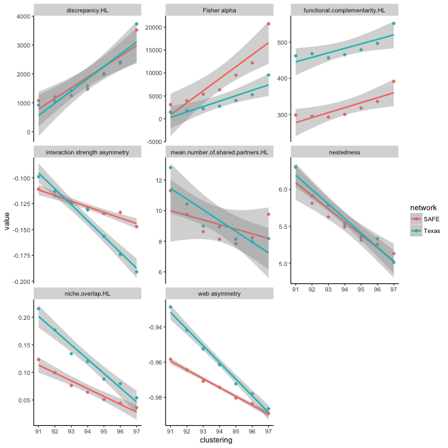

Analysing the reliability of metrics across different MOTU clustering levels:

This code is for comparing how reliable your conclusions are in inter-network analyses using metabarcoding data. I'd strongly recommend against using it for anything too serious yet as its all currently a bit unfinished. If you want to use it I'd advise contacting me first. The paper this code is supporting isn't submitted yet, and so manuals and data will be uploaded in due course.

(Dave Hemprich-Bennett, hemprich.bennett@gmail.com, @hammerheadbat)


```
# Example vignette

library(LOTUS)

library(ggplot2)

data(batnets)

ind <- c('functional complementarity',
                         'web asymmetry',
                         'Fisher alpha', 'mean number of shared partners',
                         'niche overlap',
                         'nestedness',
                         'discrepancy',
                         'ISA')

## Use the metcalcs function to see how the indices change                          
m <- metcalcs(networks= batnets, indices = ind, network_level = 'higher')

## Plot them
g <- ggplot(m , aes(x = clustering, y = value, color = network)) +<br/>
  geom_point()+<br/>
  labs(x = 'clustering') +<br/>
  geom_smooth(method = lm, se = T)+<br/>
  scale_x_continuous(breaks = seq(91, 98, 1))+<br/>
  facet_wrap(~ metric, scales = 'free_y')+<br/>
  theme(panel.grid.major = element_blank(), panel.grid.minor = element_blank(),<br/>
        panel.background = element_blank(), axis.line = element_line(colour = "black"))<br/><br/>
g
```

```
## Plot in a simpler manner using the inbuilt function
line_plot(input = m, network = 'network', clustering = 'clustering', metric = 'metric', value = 'value', plotname = 'Batnets example')
```


#Beginner's example of loading in data from multiple datasets

This asumes that you're working in a directory with two subdirectories, 'SAFE' and 'Texas', with subdirectories corresponding to the clustering level used to generate them. E.g. screenshot below


```
filenames <- list.files(pattern = '*binary*', recursive = T)

safe_filenames <- filenames[grep('SAFE', filenames)]
texas_filenames <- filenames[grep('Texas', filenames)]

SAFE <- lapply(safe_filenames, read.table, sep = '\t', header = T, stringsAsFactors = F)
names(SAFE) <- gsub('^.*/', '', dirname(safe_filenames))

texas <- lapply(texas_filenames, read.table, sep = '\t', header = T, stringsAsFactors = F)
names(texas) <- gsub('^.*/', '', dirname(texas_filenames))

netlist <- list(SAFE, texas)
names(netlist) <- c('SAFE', 'Texas')
```

The object 'netlist' will then be in the format 'net_clust' for the metcalcs function
